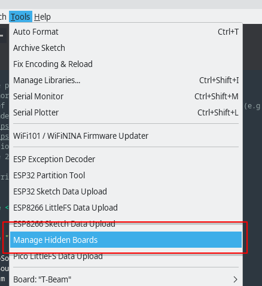
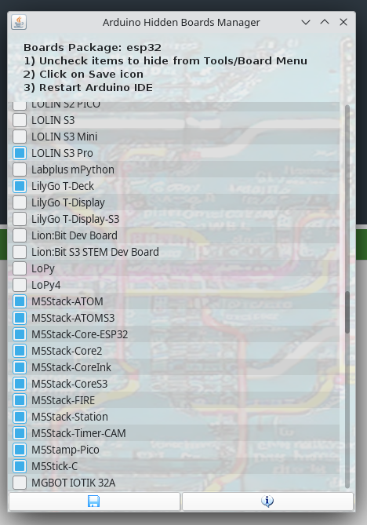
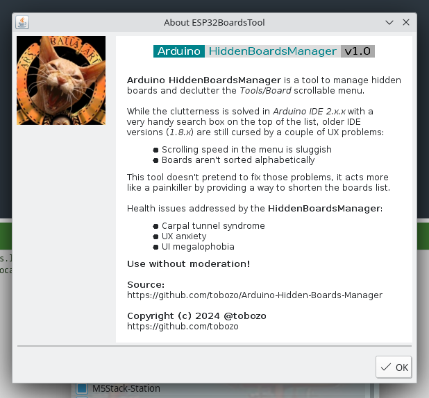

# Arduino-Hidden-Boards-Manager

## Overview

**Arduino HiddenBoardsManager** is a tool to manage hidden boards and declutter the <i>Tools/Board</i> scrollable menu in the Arduino IDE.

## Limitations

Arduino IDE 1.8.x only

## How does it work?

**Arduino HiddenBoardsManager** uses Arduino IDE's capability to mark a board as hidden, so no data is lost!

Hidden board names are saved in the `boards.local.txt` file in the package folder

## ScreenShots

#### Menu
[]

#### Hidden Boards Manager
[]

#### Credits window
[]

## Download

## Build Requirements
To build the tool, you need JDK 8 installed.

Note that anything newer will cause the Arduino IDE to crash since its only supporting java class files compiled with JDK 8 version of Java.

## Installation (Arduino IDE)
- Download the tool from releases or build it yourself
- Create a `tools` directory in your Arduino sketchbook directory if it doesn't exist yet
- Unzip the package into the `tools` directory, the path will look like: 
    `<home_dir>/Arduino/tools/HiddenBoardsManager/tool/HiddenBoardsManager.jar`
- Restart Arduino IDE

## Usage (Arduino IDE)
- Select `Tools` > `Manage Hidden Boards` menu item (see screenshot)
- Uncheck the boards to hide
- Restart Arduino IDE

## Issues and Contributions
Feel free to report any issues.

## License
This project by [tobozo](https://github.com/tobozo/) is licensed under the [MIT License](LICENSE).
